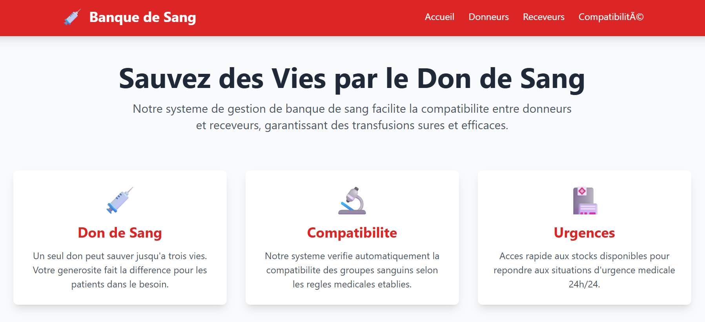
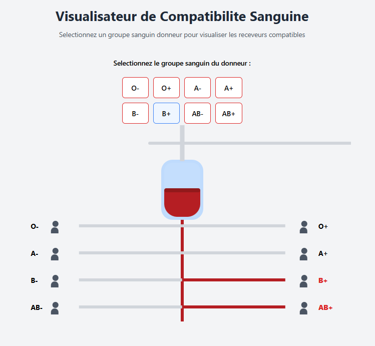
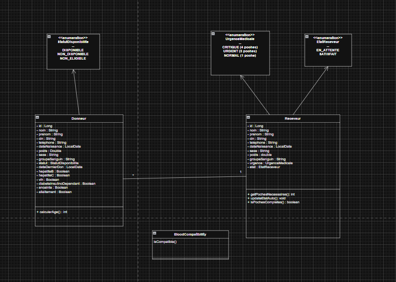
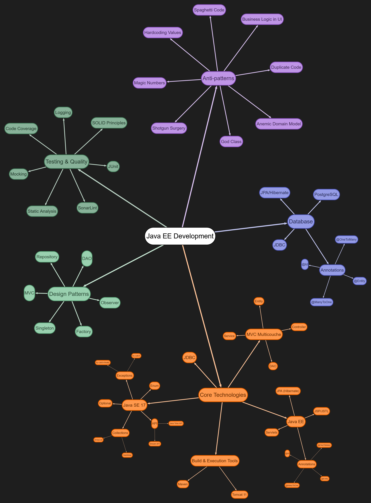

# Système de Gestion de Banque de Sang

Application web JEE pour la gestion complète des donneurs et receveurs de sang avec automatisation du matching selon les compatibilités sanguines et les urgences médicales.

---





## Visualisateur de Compatibilite Sanguine



## 📋 Table des Matières

- [Fonctionnalités](#fonctionnalités)
- [Stack Technologique](#stack-technologique)
- [Architecture](#architecture)
- [Prérequis](#prérequis)
- [Installation](#installation)
- [Configuration](#configuration)
- [Utilisation](#utilisation)
- [Tests](#tests)
- [Règles Métier](#règles-métier)
- [Diagramme de Classe](#diagramme-de-classe)
- [Gestion de Projet](#gestion-de-projet)
- [Contributeurs](#contributeurs)
- [Licence](#licence)
- [Contact](#contact)

---

## ✨ Fonctionnalités

### Gestion des Donneurs
- ✅ Création avec validation automatique d'éligibilité
- ✅ Vérification des critères : âge (18-65 ans), poids (≥50kg)
- ✅ Détection des contre-indications médicales
- ✅ Statuts automatiques : DISPONIBLE, NON_DISPONIBLE, NON_ELIGIBLE
- ✅ Association avec un receveur compatible
- ✅ Liste avec filtres et recherche
- ✅ Modification et suppression

### Gestion des Receveurs
- ✅ Création avec niveau d'urgence (CRITIQUE, URGENT, NORMAL)
- ✅ Tri automatique par priorité décroissante
- ✅ Suivi du besoin en poches de sang (4, 3 ou 1)
- ✅ État automatique : EN_ATTENTE → SATISFAIT
- ✅ Association avec plusieurs donneurs compatibles
- ✅ Liste avec filtres et recherche
- ✅ Modification et suppression

### Compatibilité Sanguine
- ✅ Matrice de compatibilité complète
- ✅ O- : donneur universel (compatible avec tous)
- ✅ AB+ : receveur universel (peut recevoir de tous)
- ✅ Visualisateur interactif de compatibilité
- ✅ Affichage uniquement des entités compatibles lors de l'association

---

## 🛠 Stack Technologique

**Backend**
- Java 8+
- JEE : Servlets, JSP, JSTL
- JPA/Hibernate : ORM
- Maven : Gestion des dépendances
- MySQL/PostgreSQL : Base de données

**Frontend**
- JSP : Pages dynamiques
- JSTL : Tags pour la logique d'affichage
- Tailwind CSS : Framework CSS moderne
- JavaScript : Interactions côté client

**Serveur**
- Apache Tomcat

**Tests**
- JUnit : Tests unitaires et d'intégration

---

## 🏗 Architecture

Architecture MVC Multicouches :

```
src/
├── main/
│ ├── java/
│ │ ├── ma.banquesang.controller/ # Servlets
│ │ ├── ma.banquesang.service/ # Logique métier
│ │ ├── ma.banquesang.dao/ # Accès aux données
│ │ ├── ma.banquesang.model/ # Entités JPA
│ │ └── ma.banquesang.util/ # Utilitaires
│ ├── resources/
│ │ └── META-INF/
│ │ └── persistence.xml # Configuration JPA
│ └── webapp/
│ ├── WEB-INF/
│ │ └── web.xml # Configuration Servlets
│ ├── index.jsp
│ ├── donneurs.jsp
│ ├── receveurs.jsp
| |--find.jsp
│ └── creation.jsp
└── test/
└── java/ # Tests JUnit
```


**Design Patterns Utilisés**
- Repository Pattern
- Singleton Pattern
- MVC Pattern
- DAO Pattern
- Service Layer Pattern

---

## 📦 Prérequis
- JDK 8+
- Maven 3.6+
- Apache Tomcat 9+
- PostgreSQL 12+
- IDE : IntelliJ IDEA / Eclipse / NetBeans

---

## 🚀 Installation

1. **Cloner le projet**
```bash
git clone https://github.com/votre-username/banque-sang.git
cd banque-sang

```
```sql 
CREATE DATABASE banque_sang CHARACTER SET utf8mb4 COLLATE utf8mb4_unicode_ci;
```
2. **Configurer persistence.xml**

```xml
<persistence-unit name="banque-sang-pu">
    <properties>
        <property name="javax.persistence.jdbc.url" value="jdbc:mysql://localhost:3306/banque_sang"/>
        <property name="javax.persistence.jdbc.user" value="root"/>
        <property name="javax.persistence.jdbc.password" value="votre_password"/>
        <property name="hibernate.hbm2ddl.auto" value="update"/>
    </properties>
</persistence-unit>
```

4. **Compiler avec Maven**

```bash
mvn clean install
```
# Utilisation

Page d'Accueil : Vue générale et visualisateur de compatibilité

Ajouter un Donneur : Formulaire avec validation automatique

Ajouter un Receveur : Formulaire avec niveau d'urgence

Associer Donneur-Receveur : Affichage uniquement des compatibilités

Filtrer et Rechercher : Par groupe sanguin, statut ou urgence

# 🧪 Tests

```bash
mvn test
```

# 📊 Règles Métier

## Critères d'Éligibilité des Donneurs

| Critère                  | Valeur Requise       |
|---------------------------|--------------------|
| Âge                       | 18 - 65 ans        |
| Poids                     | ≥ 50 kg            |
| Hépatite B/C              | Non                |
| VIH                       | Non                |
| Diabète insulino-dépendant| Non                |
| Grossesse                 | Non                |
| Allaitement               | Non                |

## Niveaux d'Urgence et Poches Nécessaires

| Urgence   | Poches | Priorité  |
|-----------|--------|----------|
| CRITIQUE  | 4      | Maximale |
| URGENT    | 3      | Élevée   |
| NORMAL    | 1      | Standard |

## Statuts

**Donneurs** : DISPONIBLE, NON_DISPONIBLE, NON_ELIGIBLE  
**Receveurs** : EN_ATTENTE, SATISFAIT

# 📈 Diagramme de Classe




# schéma récapitulatif



# 📝 Gestion de Projet

Méthodologie : Scrum / JIRA

User Stories, Sprints d’1 semaine, Backlog priorisé, Burndown chart

# 👥 Contributeurs

IMILY ABDERRAZZAK

# 📞 Contact

Pour toute question : azeimily2001@gmail.com