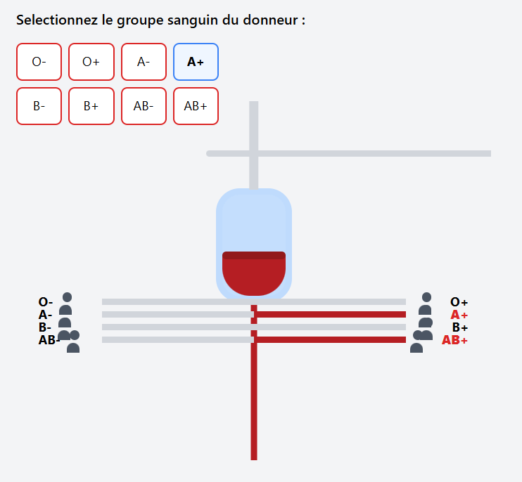

# Système de Gestion de Banque de Sang

Application web JEE pour la gestion complète des donneurs et receveurs de sang avec automatisation du matching selon les compatibilités sanguines et les urgences médicales.

---


## Visualisateur de Compatibilite Sanguine



## 📋 Table des Matières

- [Fonctionnalités](#fonctionnalités)
- [Stack Technologique](#stack-technologique)
- [Architecture](#architecture)
- [Prérequis](#prérequis)
- [Installation](#installation)
- [Configuration](#configuration)
- [Utilisation](#utilisation)
- [Tests](#tests)
- [Règles Métier](#règles-métier)
- [Diagramme de Classe](#diagramme-de-classe)
- [Fonctionnalités Bonus](#fonctionnalités-bonus)
- [Gestion de Projet](#gestion-de-projet)
- [Contributeurs](#contributeurs)
- [Licence](#licence)
- [Contact](#contact)

---

## ✨ Fonctionnalités

### Gestion des Donneurs
- ✅ Création avec validation automatique d'éligibilité
- ✅ Vérification des critères : âge (18-65 ans), poids (≥50kg)
- ✅ Détection des contre-indications médicales
- ✅ Statuts automatiques : DISPONIBLE, NON_DISPONIBLE, NON_ELIGIBLE
- ✅ Association avec un receveur compatible
- ✅ Liste avec filtres et recherche
- ✅ Modification et suppression

### Gestion des Receveurs
- ✅ Création avec niveau d'urgence (CRITIQUE, URGENT, NORMAL)
- ✅ Tri automatique par priorité décroissante
- ✅ Suivi du besoin en poches de sang (4, 3 ou 1)
- ✅ État automatique : EN_ATTENTE → SATISFAIT
- ✅ Association avec plusieurs donneurs compatibles
- ✅ Liste avec filtres et recherche
- ✅ Modification et suppression

### Compatibilité Sanguine
- ✅ Matrice de compatibilité complète
- ✅ O- : donneur universel (compatible avec tous)
- ✅ AB+ : receveur universel (peut recevoir de tous)
- ✅ Visualisateur interactif de compatibilité
- ✅ Affichage uniquement des entités compatibles lors de l'association

---

## 🛠 Stack Technologique

**Backend**
- Java 8+
- JEE : Servlets, JSP, JSTL
- JPA/Hibernate : ORM
- Maven : Gestion des dépendances
- MySQL/PostgreSQL : Base de données

**Frontend**
- JSP : Pages dynamiques
- JSTL : Tags pour la logique d'affichage
- Tailwind CSS : Framework CSS moderne
- JavaScript : Interactions côté client

**Serveur**
- Apache Tomcat

**Tests**
- JUnit : Tests unitaires et d'intégration

---

## 🏗 Architecture

Architecture MVC Multicouches :

```
src/
├── main/
│ ├── java/
│ │ ├── ma.banquesang.controller/ # Servlets
│ │ ├── ma.banquesang.service/ # Logique métier
│ │ ├── ma.banquesang.dao/ # Accès aux données
│ │ ├── ma.banquesang.model/ # Entités JPA
│ │ └── ma.banquesang.util/ # Utilitaires
│ ├── resources/
│ │ └── META-INF/
│ │ └── persistence.xml # Configuration JPA
│ └── webapp/
│ ├── WEB-INF/
│ │ └── web.xml # Configuration Servlets
│ ├── index.jsp
│ ├── donneurs.jsp
│ ├── receveurs.jsp
| |--find.jsp
│ └── creation.jsp
└── test/
└── java/ # Tests JUnit
```
